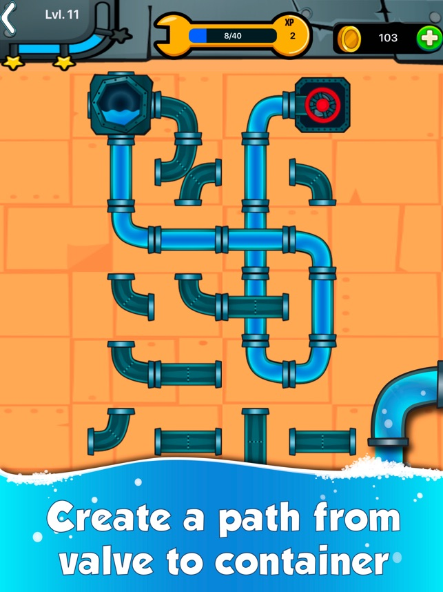
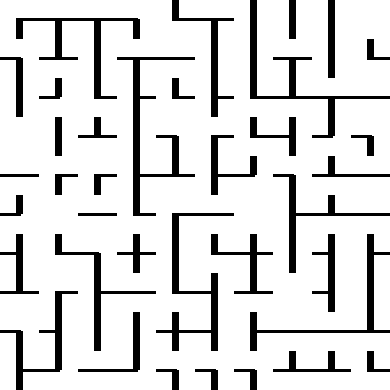
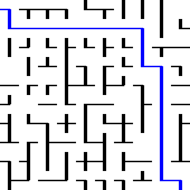

# Hydraulic Rotations Gym.ai environment

This repository contains an implementation of a "hydraulic rotations" environment.
This environment represents a popular arcade game colloqiualy referred to as "Water Pipe", "Plumber game" or "Pipes". The goal of this environment is to rotate a series of pipes in order to allow water to flow from a singular inlet to a singular outlet.

## Introduction

You might be familiar with this or similar game:

Such games improve mental capacity and logical thinking.
This repository contains gym.ai implementation of this environment
so it can be used in reinforcement learning.

## Showcase

This is how, in this implementation, an unsolved map looks like.

This is how, in this implementation, a solved environment looks like.